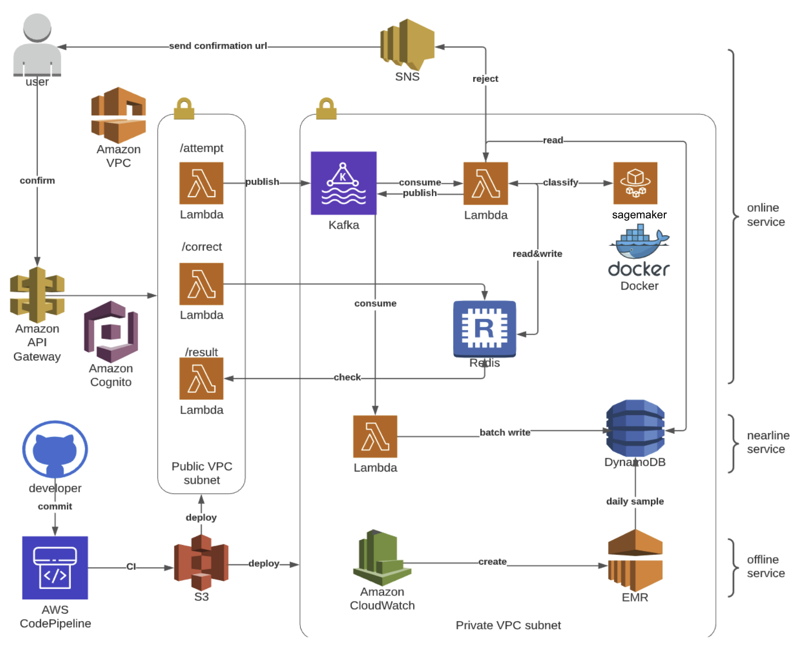
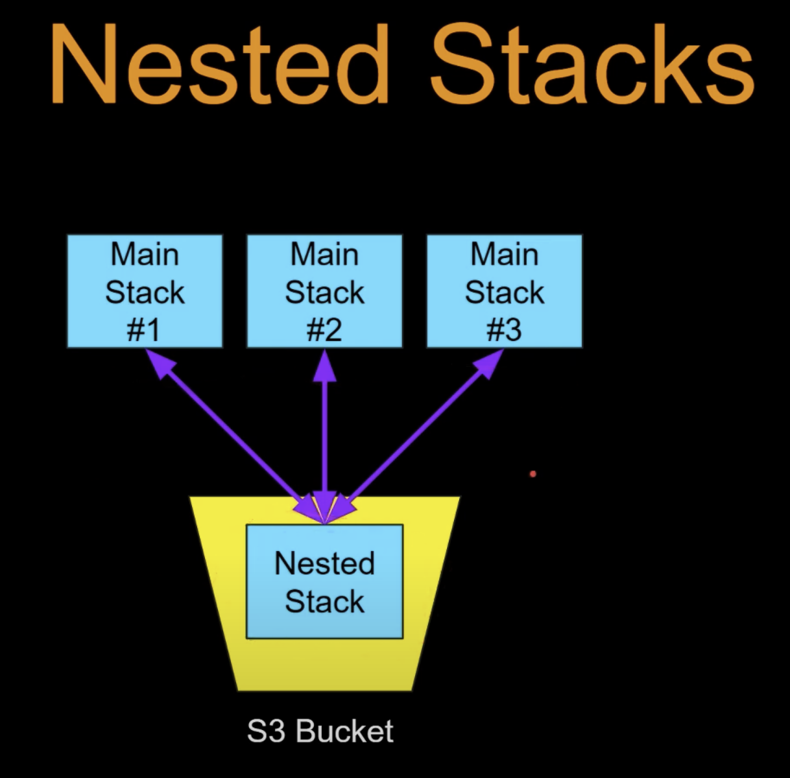

# 6896-fraud-detection-sys
Fraud Detection System for EECS6895. You can refer to the following link for more detail

- [Course Website](https://www.ee.columbia.edu/~cylin/course/bigdata/)
- [Presentation Slide](https://docs.google.com/presentation/d/1QPT03eQqLqWtC-5WC8MHB_62q0hqXK4BzFQXrbw8tOU/edit?usp=sharing): Project ideas
- [Video](https://youtu.be/Q0rks0ldXAY): Use case
- [Report](COMS4995_Final_Report.pdf): Theoretical and implementation detail 
# System Architecture

As shown in our architecture, the system has three components: online service, nearline service, and offline service. We complete all the components. 
- Online Service: The online service receives a transaction, sent it to Kafka and get classification result from AWS SageMaker endpoint. The classification result will be cached to Redis for query. If a transaction is approved, the result will be published to a different topic in Kafka for asynchronous batch write to DynamoDB. If a transaction is rejected, the result will only be cached to Redis and will expire in 7 days if the user does not approve it.
- Nearline Service: Writing to database is slow, which will unnecessarily burn the core classification system. Therefore, we design a separate service that batch write approved transaction to database. Only this lambda function has Write Permission to DynamoDB for security.
- Offline Service: It is important to note that this fraud detection system should not hold all user history in the database. User history accumulates overtime, which will gradually slow down the unsupervised ML model. Therefore, a scheduled Spark job is created to regularly downsample user history in DynamoDB.

You can check out our [Report](COMS4995_Final_Report.pdf) for [Video](https://youtu.be/Q0rks0ldXAY) and [Report](COMS4995_Final_Report.pdf) more details

# Source Code
Our codes are used in Lambda Functions to connect different services. You can check our [src](src/) folder to see our codes
# Deploy the Project
We wrap all our services in AWS CloudFormation. As long as you have [AWS accout](https://aws.amazon.com/account/), you can use our template to deploy all the sevices
```shell script

aws cloudformation create-stack --stack-name 6895-fraud-detection --template-body file://cloudformation/root.yaml --capabilities CAPABILITY_AUTO_EXPAND
```

You can delete the whole project just using
```shell script
aws cloudformation delete-stack --stack-name 6895-fraud-detection
```

For more information with respect to cloudFormation, checkout [here](https://aws.amazon.com/cloudformation/)

One deployed, the project will be ready to use. chckout the and for more detail
# AWS CloudFormation
## Nested stack v.s Cross-stack referencing



## References
https://docs.aws.amazon.com/AWSCloudFormation/latest/UserGuide/walkthrough-crossstackref.html

https://docs.aws.amazon.com/AWSCloudFormation/latest/UserGuide/outputs-section-structure.html

https://www.youtube.com/watch?v=eoiSBAtRxZg

https://stackoverflow.com/questions/56157423/cloudformation-cross-stack-vs-nested-stack#:~:text=2%20Answers&text=You%20should%20use%20cross%2Dstack,and%20updating%20the%20stacks%20independently.

## Resources
1. Host ML model on AWS Sagemaker: 
    * sample code: https://towardsdatascience.com/deploying-a-scikit-learn-model-on-aws-using-sklearn-estimators-local-jupyter-notebooks-and-the-d94396589498 
    * documentation: https://sagemaker.readthedocs.io/en/stable/frameworks/sklearn/using_sklearn.html#sagemaker-scikit-learn-model-server
    * Isolation forest: https://scikit-learn.org/stable/modules/generated/sklearn.ensemble.IsolationForest.html 
    * Local Outlier Factor: https://scikit-learn.org/stable/modules/generated/sklearn.neighbors.LocalOutlierFactor.html
2. Nested Cloudformation Stack And Parameter Sharing:
    * https://aws.amazon.com/premiumsupport/knowledge-center/cloudformation-nested-stacks-values/
3. Fraud Data Generation: 
    * https://blog.clover.com/how-to-detect-in-store-credit-card-fraud/
    * https://www.semanticscholar.org/paper/Data-mining-for-credit-card-fraud%3A-A-comparative-Bhattacharyya-Jha/9d26f0ba02ee5efe9b9c7bdcb5f528c8b8253cf7?p2df
    * https://www.identityguard.com/news/credit-card-fraud-detection
    * https://lbezone.ust.hk/pdfviewer/web/viewer.php?file=aHR0cHM6Ly9sYmV6b25lLnVzdC5oay9vYmovMS9vL2IxMDIzMjM4L2IxMDIzMjM4LnBkZg==#page=1
    * MUST READ: https://github.com/namebrandon/Sparkov/blob/master/README.md
   * https://arxiv.org/pdf/1709.08920.pdf
